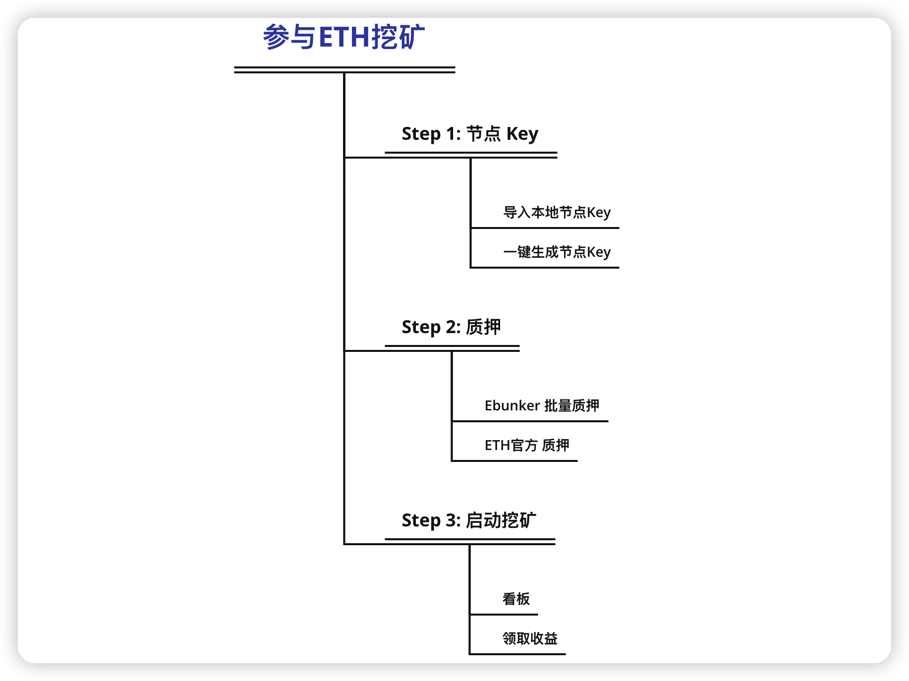

# 介绍

## 介绍

Ebunker 是领先的非托管 ETH Staking 矿池，我们的使命是赋能ETH网络安全，为Web3提供去中心化入口。

Ebunker让ETH 持有者收益最大化，我们承诺代码完全开源，非托管模式确保了用户的资金安全。

#### 非托管矿池

* 用户保管节点助记词
* 用户保管本金私钥
* Ebunker仅保有节点私钥
* 节点私钥只能运行节点，无法触碰用户本金

<figure><figcaption></figcaption></figure>

#### 挖矿操作

<figure><figcaption></figcaption></figure>

**质押方案**

Ebunker提供了两种方式生成节点Key

* 方法 1：一站式节点质押
  * 优点：操作流程安全方便快捷
  * 缺点：在网页中进行助记词的生成，为提高安全性，需要在断开网络后操作该步骤，
* 方法 2：第三方程序节点质押
  * 优点：用ETH基金会推荐软件生成助记词，安全性高
  * 缺点：操作非常复杂，需要较高的软件操作能力

**质押合约**

节点Key生成后，Ebunker将在后台为您部署节点，一旦节点部署成功，您就可以质押相应的ETH，目前每1节点需要准备32个ETH。

Ebunker有两种调用质押合约的方式

* EBUNKER批量质押合约：
  * 优点：一次合约调用可以完成多个节点的质押，质押合约安全快捷，提供了便捷和安全，该合约已通过慢雾科技安全审计。
  * 缺点：Ebunker批量质押合约为Ebunker团队编写
* ETH官方质押：
  * 优点：为ETH基金会质押方式
  * 缺点：在LaunchPad网站中，每个节点都要单独质押，当节点数较多时，需要耗费大量时间。反复操作，增加了误操作的风险。

**看板**

质押完成后，您可以在《看板》板块中查看您的相关信息，包括

* 质押收益
* 节点信息

Ebunker爆块奖励采用PPLNS机制，执行层爆块儿后，Ebunker将按照节点激活状态平分到每个节点上。您可以在看板页面看到可领取奖励。

点击“领取奖励”，Ebunker将会把收益发送到您的登录钱包中，需要说明的是：

* 最小领取奖励是0.01ETH，
* 领取奖励需要耗费ETH网络打包费，该打包费是0.005ETH，该费用由用户自行承担

#### 让我们开始质押吧！
