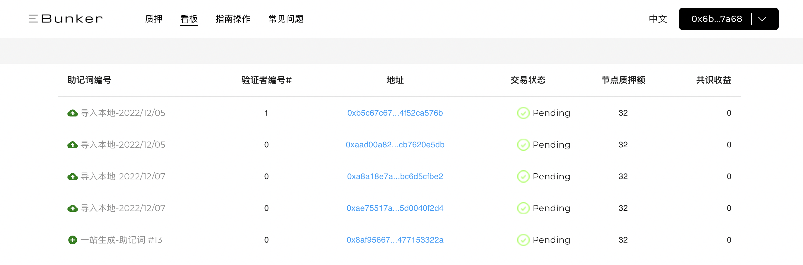

# 看板

### 恭喜您！已经完成以太坊验证者的创建!

推荐使用Ebunker官方看板来查看您的节点及收益状态。

* **工具链接**
  * Ebunker看板：[https://www.ebunker.io/dashboard](https://www.ebunker.io/dashboard)
  * ETH官方浏览器：[https://beaconcha.in](https://beaconcha.in/)
* **查询验证者及收益信息**
  * 打开[Ebunker看板](https://www.ebunker.io/dashboard)可查询到验证者信息。 &#x20;
  *

      <figure><figcaption></figcaption></figure>
  *

      <figure><figcaption></figcaption></figure>
  * 点击Ebunker面板内的验证者`PUBLIC KEY`跳转至官方浏览器，也可查看到验证者状态和本金与收益的详细信息。&#x20;
