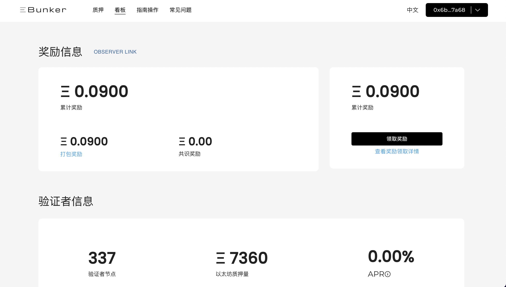
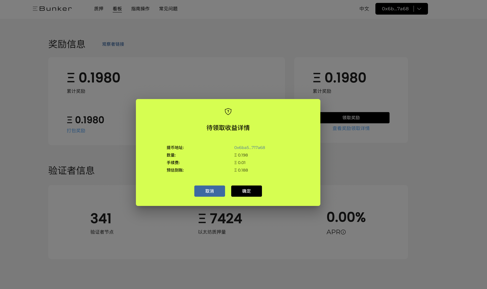
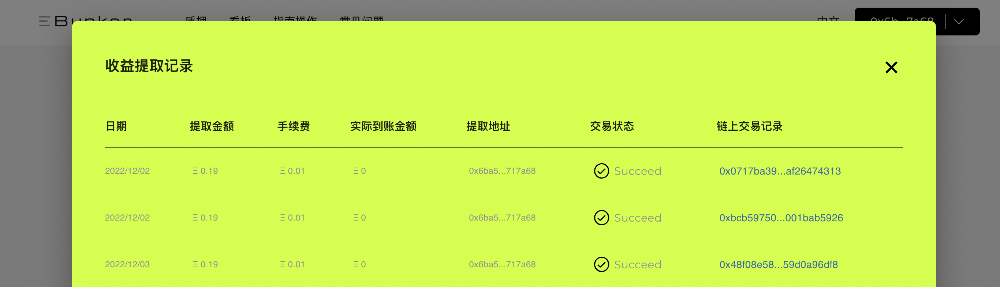

# 领取收益

### 1.收益组成

参与ETH质押并激活节点后，会产生以下奖励：共识层固定奖励、共识层出块奖励、执行层出块奖励、MEV收益。

* 共识层的收益将分发至节点余额内，在上海升级后可取出。
* 执行层收益将归集到Ebunker矿池地址，按照节点数量与激活天数的乘积的比例分发收益。用户可在Ebunker官网查看并领取该部分奖励。

### 2.收益提取

* 点击[ https://www.ebunker.io/dashboard ](https://www.ebunker.io/dashboard)，打开看板查看收益并领取。
*

    <figure><figcaption></figcaption></figure>

<figure><figcaption></figcaption></figure>

### 3.查看收益状态

* 点击`领取收益`下方的`查看奖励领取详情`按钮，查看领取收益状态 &#x20;

<figure><figcaption></figcaption></figure>

<figure><figcaption></figcaption></figure>
