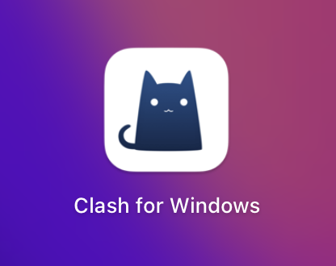
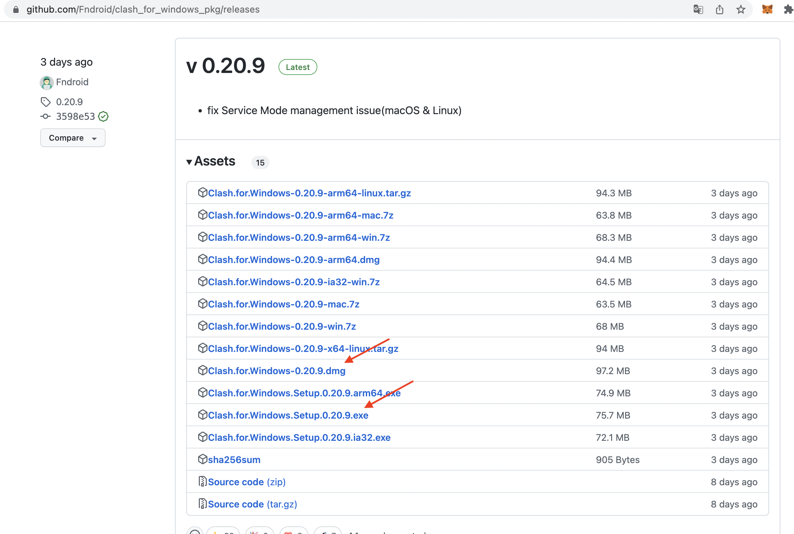
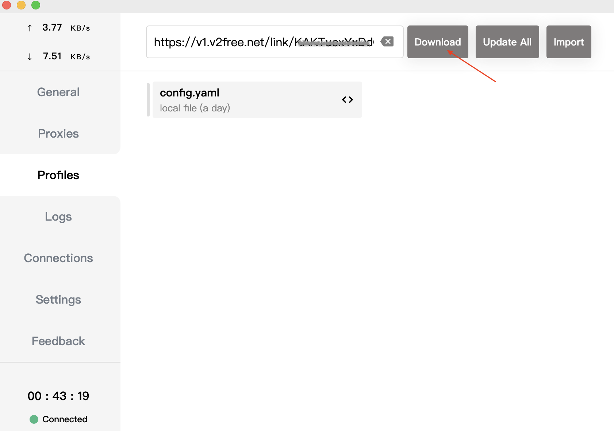
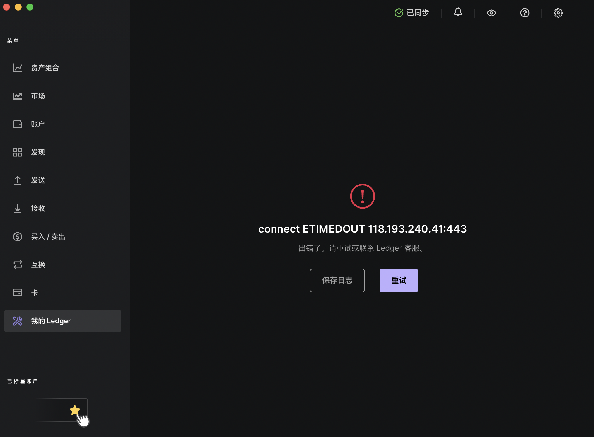
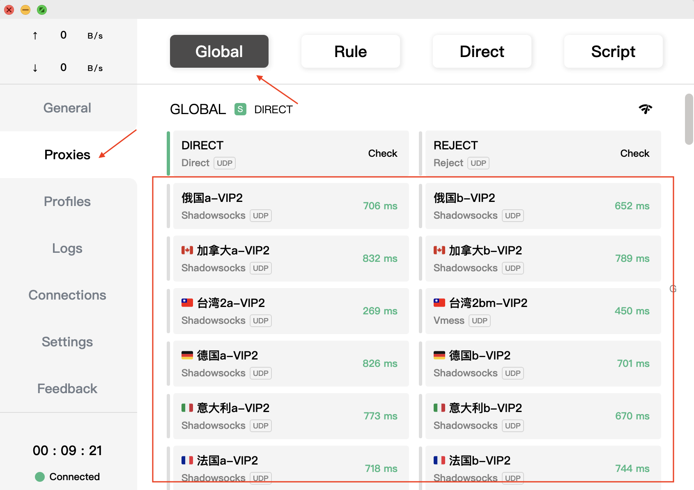
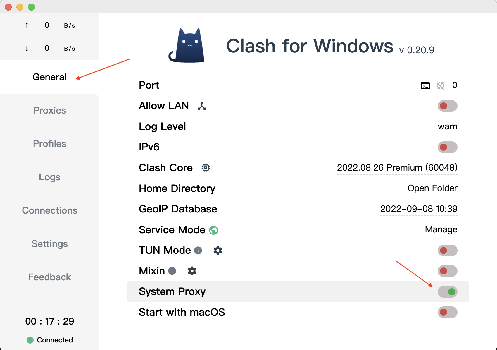
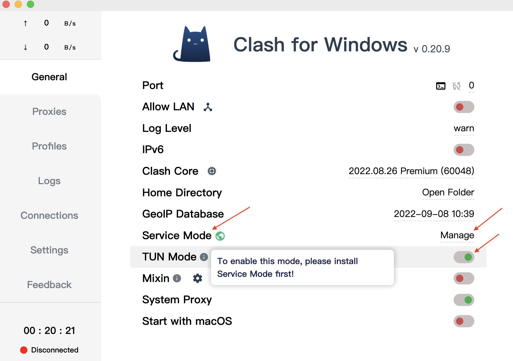
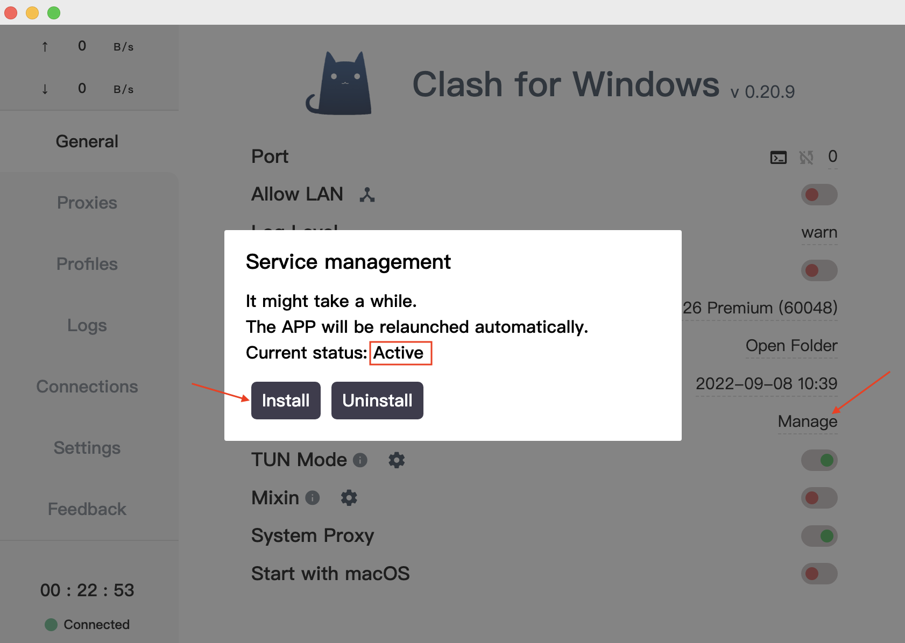
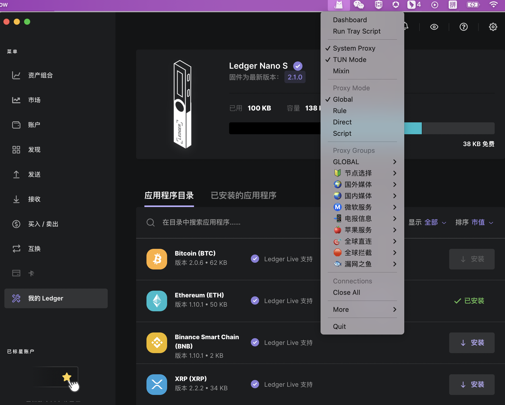

# Ledger无法调起交易

### 在使用Metamask+Ledger执行质押交易，无法调起Ledger上的授权App，交易总是超时失败

### 【解决办法】

* 1.启用[盲签](https://support.ledger.com/hc/zh-cn/articles/4405481324433-%E5%9C%A8%E4%BB%A5%E5%A4%AA%E5%9D%8A-ETH-%E5%BA%94%E7%94%A8%E7%A8%8B%E5%BA%8F%E4%B8%AD%E5%90%AF%E7%94%A8%E7%9B%B2%E7%AD%BE%E5%90%8D?docs=true)并打开Debug模式，步骤如下：
  * 连接并解锁您的 Ledger 设备。
  * 打开以太坊应用程序。
  * 按右键导航到`Settings`设置。然后同时按两个按钮进行选择。
  * 在`Blind signing`盲签设置中，同时按下两个按钮将`NOT Enabled`切换为`Enabled`以启用盲签交易。
  * 按右键查看`Debug data`设置，同时同时按下两个按钮将`NOT Displayed`切换为`Displayed`以启用排除故障数据。
  * 更改完成按右键两次显示`Back`，同时按下两个按钮点击返回主页。 

### 2. 使用Ledger时，其配套使用的Ledger Live应用提示“无法同步”

【解决办法】 建议使用科学上网工具Clash

#### Clash介绍

* Clash 是一个使用 Go 语言编写，基于规则的跨平台代理软件核心程序
*

    <figure><figcaption></figcaption></figure>
* 点击链接下载安装最新版本安装包➡️[Clash](https://github.com/Fndroid/clash\_for\_windows\_pkg/releases)
  * windows下载：Clash.for.Windows.Setup.X.X.X.exe
  * mac下载：Clash.for.Windows-XXX.dmg
  * 下载完成点击安装包进行安装。**注：Mac安装后无法打开，参见此处更改**安全设置&#x20;

<figure><figcaption></figcaption></figure>

#### Clash设置

安装完成后进行Clash代理设置：

* 上传下载代理工具
  * 点击`Profiles`，导入你的订阅文件，或输入Clash 配置订阅链接URL(从购买节点的地方复制)-点击`Download`-下载SUCCESS!。
  * 下载成功会自动切换配置文件。

<figure><figcaption></figcaption></figure>

### 3.打开了VPN代理，Ledger Live依旧提示“无法同步”

【解决办法】 LedgerLive不支持代理设置，只能通过全局模式，而全局模式必须要TUN模式才能正常工作。 需要使用Clash，并打开代理全局模式及TUN模式。

<figure><figcaption></figcaption></figure>

* 错误状态：&#x20;
* 打开全局模式：Global
  * 点击Proxies，选择Global，勾选一个有效节点即可使用。(无特殊情况可使用Rule模式)
  *   模式说明：

      Rule：规则模式，智能分流，不干扰国内软件使用。 Global：全局模式 ，全局使用代理。 Direct：直连模式，不使用代理&#x20;
*

    <figure><figcaption></figcaption></figure>
* 打开系统代理：System Proxy
  * 点击General，打开System Proxy，弹框选择Install，打开系统代理，即可科学上网。&#x20;
*

    <figure><figcaption></figcaption></figure>
* 打开 TUN Mode
  * 打开TUN Mode，设置说明使用TUN Mode需打开Service Mode。
  * 点击Service Mode - Manage，点击Install，Current status显示Active，(如已Active请忽略) &#x20;

<figure><figcaption></figcaption></figure>

<figure><figcaption></figcaption></figure>

### 4. 以上设置全都设置完成，Ledger Live依旧提示“无法同步”

【解决办法】

* 若无法同步，请点击Proxies(见Clash设置第二步)，更换节点。
* 若依旧无法同步，请关闭LedgerLive重新打开，多次尝试。&#x20;

<figure><figcaption></figcaption></figure>

