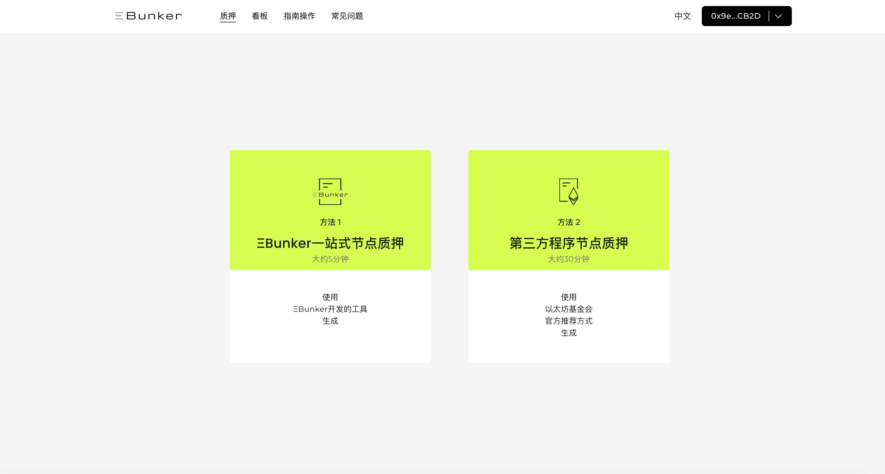
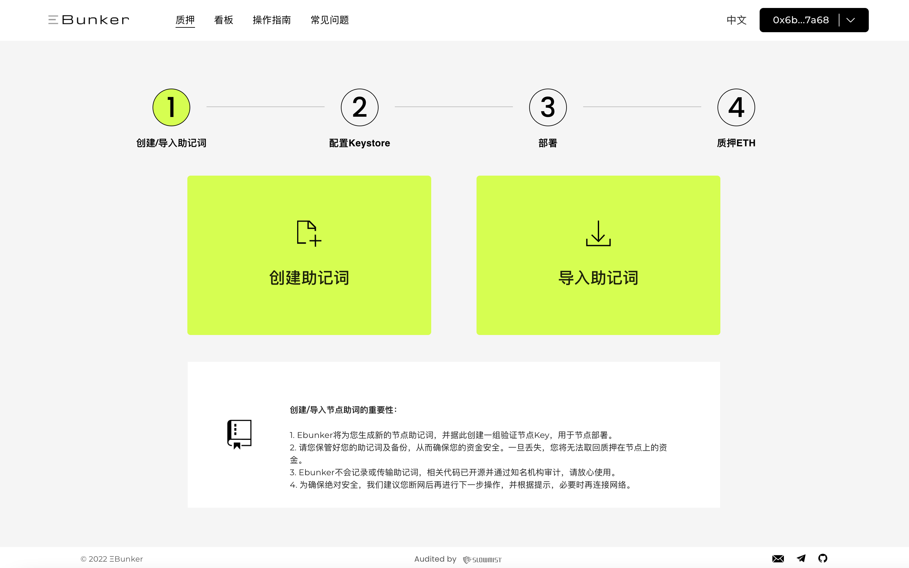
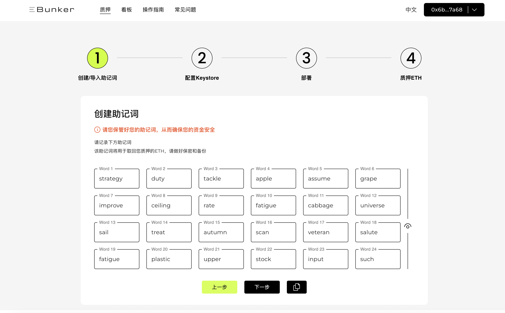
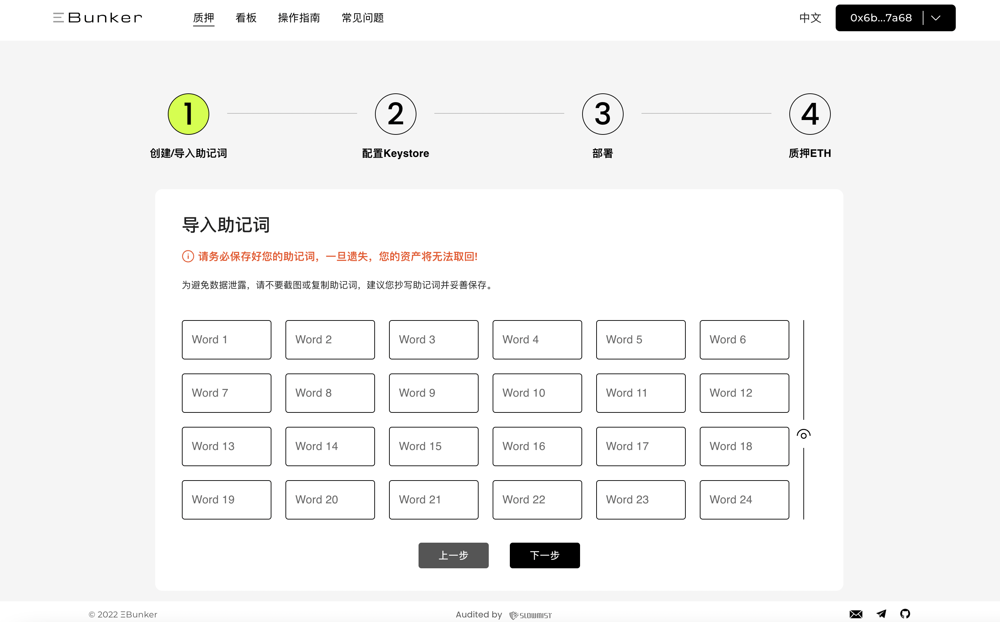

# Step 1: 创建/导入验证节点助记词

### 一、简介

Ebunker开发了最安全的ETH Keystore生成工具，使用Ebunker官方工具，帮助您一站式轻松快速完成助记词创建、Keystore生成及加密上传。

### 二、使用工具

Ebunker官方网站：[https://www.ebunker.io/](https://www.ebunker.io/)

### 三、创建/导入助记词

#### 创建助记词

* ❗️❗️请断开网络，为保证助记词安全，尽量避免在联网状态下创建助记词。
* 助记词是唯一可操作资产的私钥，助记词丢失或泄漏，资产将有丢失风险甚至无法找回。您可通过以下两种方式进行助记词及密钥文件生成。
* 点击`Ebunker一站式节点质押`&#x20;
*

    <figure><figcaption></figcaption></figure>
* 点击`创建助记词`，记录保存助记词，建议记录在物理设备上。 ❗️❗️助记词是您取回质押本金的唯一凭证，请务必做好保密和备份，否则将会造成您质押本金的损失。 &#x20;
*

    <figure><figcaption></figcaption></figure>
*

    <figure><figcaption></figcaption></figure>
* 点击下一步，将助记词填入输入框内，进行验证。验证通过，助记词创建完成。

#### 导入助记词

* 若此前有创建的助记词，则点击`导入助记词`。 &#x20;

<figure><figcaption></figcaption></figure>

<figure><figcaption></figcaption></figure>
