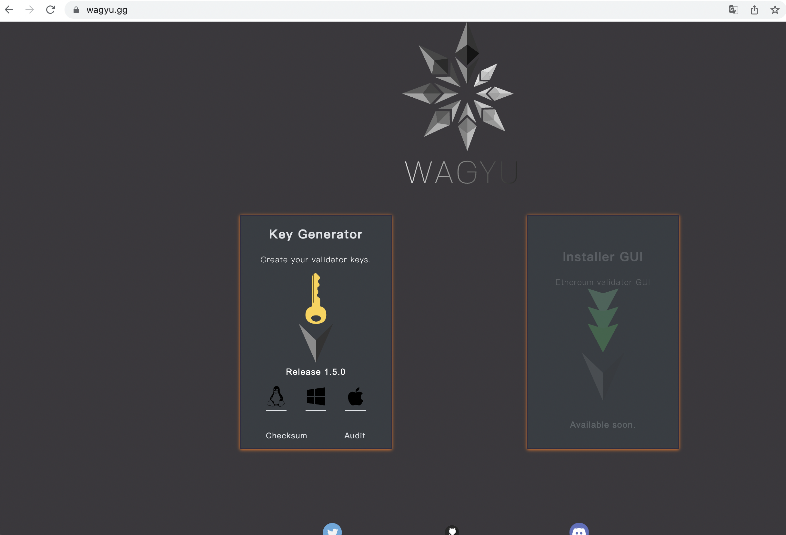
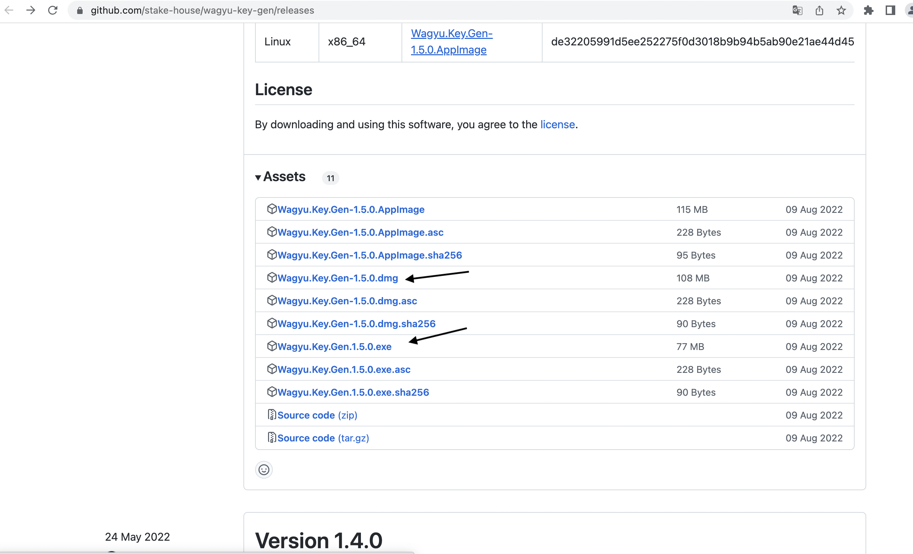
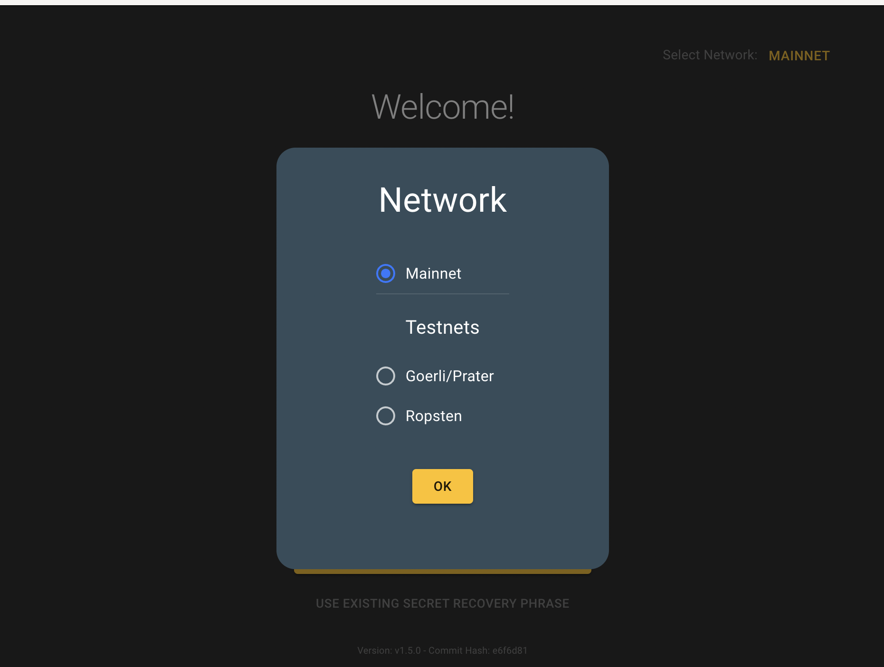
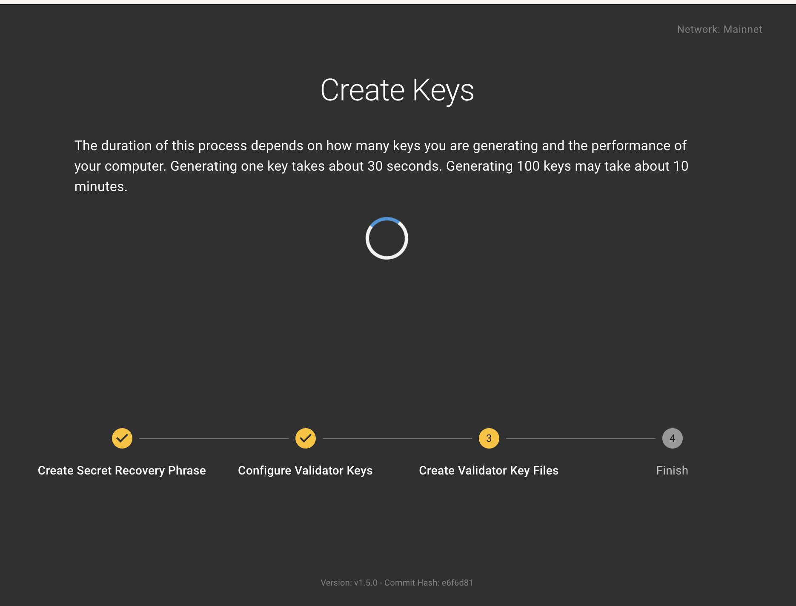
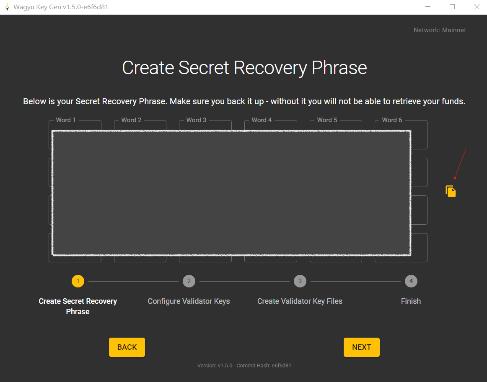
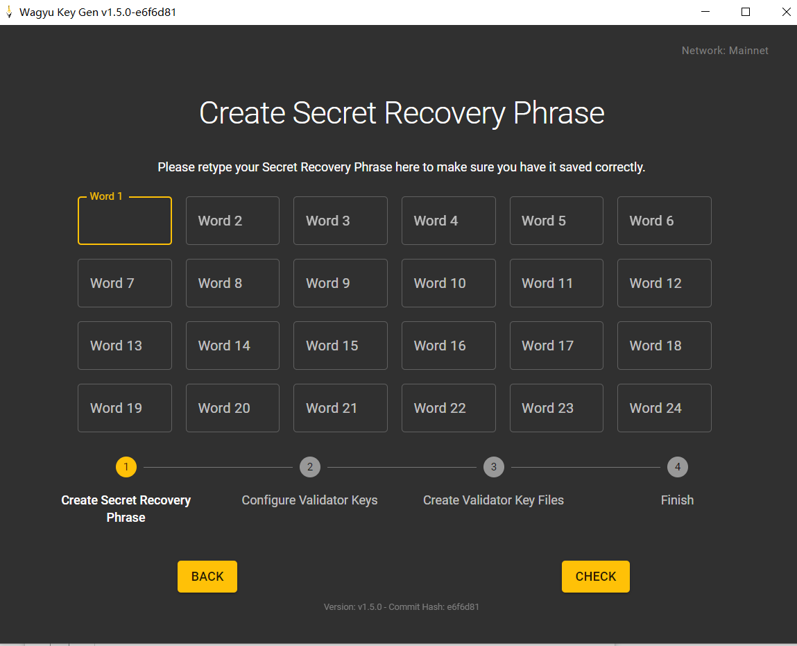
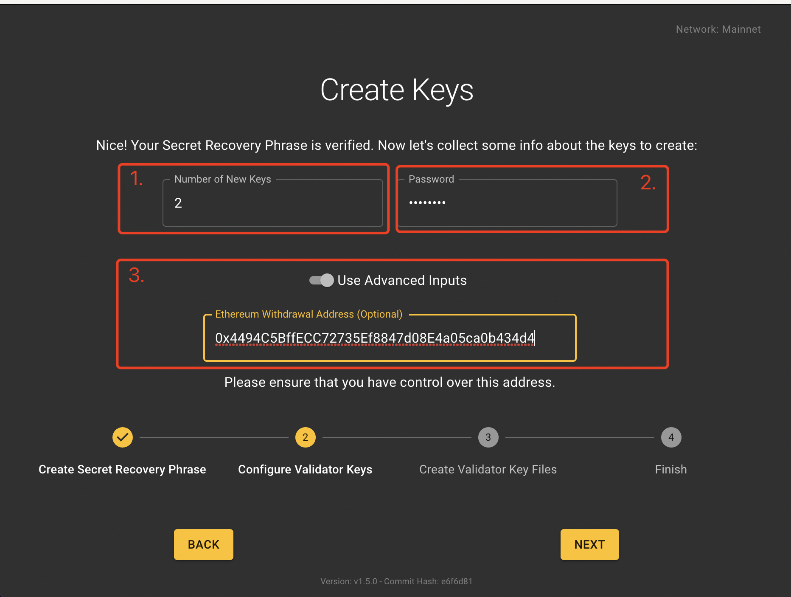
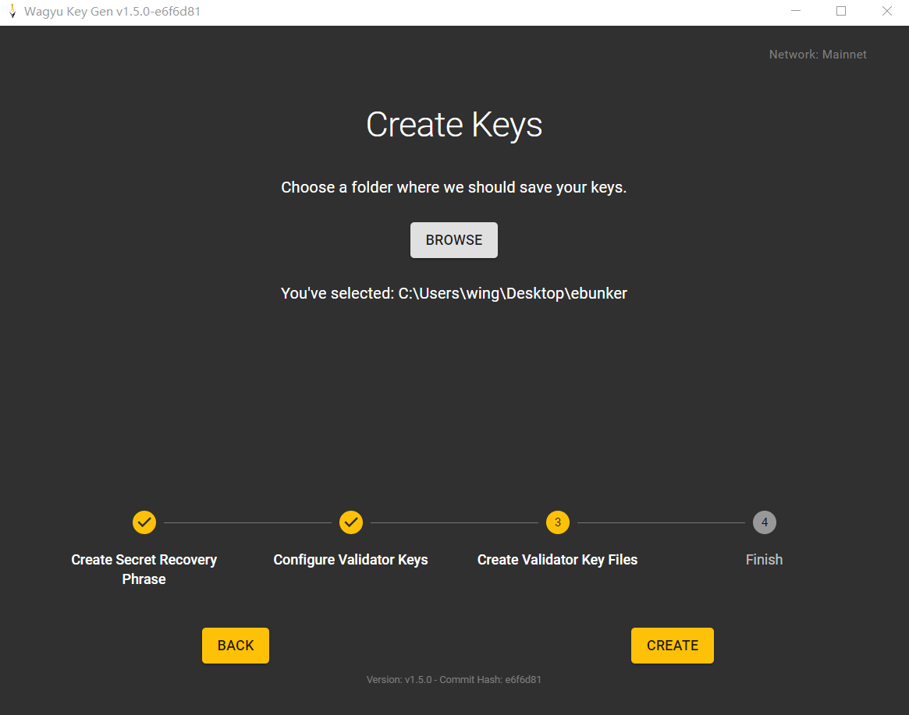
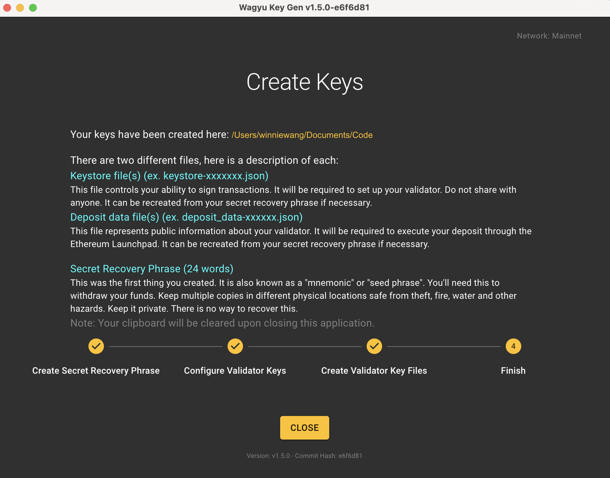
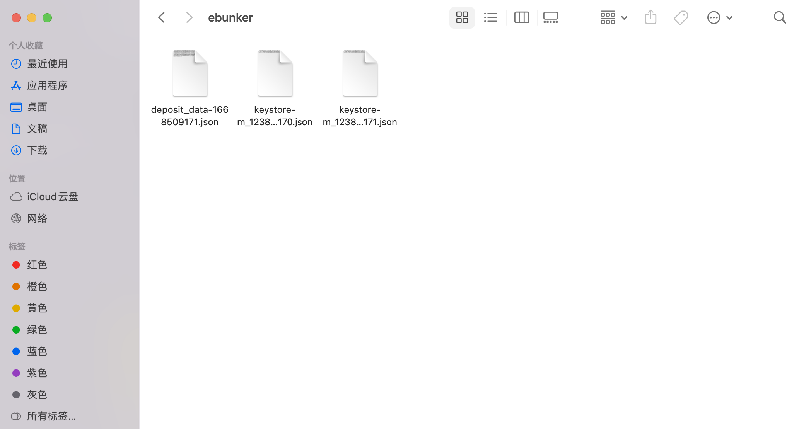

# Step 0: 创建节点节点助记词及对应节点

### 一、简介

使用ETH基金会推荐软件（Wagyu）生成，接下来的操作将生成三种密钥文件，关于密钥文件的描述如下：

```
1. 秘密恢复短语（24 字）
这是您创建的第一个密钥，它也被称为“助记符”或“种子短语”。拥有它方可操作提取您的资金，必须将其完整保存且保持私密。❗️❗️丢失后无法恢复，尽量将多份副本保存在不同的物理位置，以防被盗、或遭受火灾、水灾及其他危险。

2. 密钥库文件（例如 keystore-xxxxxxx.json）
此文件仅拥有签署区块的能力，无法控制转账。它需要用来设置您的验证器，除搭建节点人员外，尽量不要与任何人分享。丢失后可以使用助记词恢复它。

3. 存款数据文件（例如 deposit_data-xxxxxx.json）
此文件代表有关您的验证器的公共信息。需要通过 Ethereum Launchpad 执行您的存款。丢失后可以使用助记词恢复它。
```

### 二、使用工具

* Wagyu Key Gen
* 官方网站：[Wagyu](https://wagyu.gg/)
* Github：[wagyu-key-gen](https://github.com/stake-house/wagyu-key-gen)

❗️❗️为保证私钥安全，建议从离线机器上安装运行“Wagyu Key Gen”，或在断开互联网连接情况下进行。

### 三、 安装 Wagyu Key Gen

#### 3.1 软件下载：

**(1) 官方网站下载**

* 点击👉[官方下载源](https://wagyu.gg/)，根据您的设备型号选择下载，官方版本为最新版本。

<figure><figcaption></figcaption></figure>

**(2) Github下载：**

* 点击👉[Git下载源](https://github.com/stake-house/wagyu-key-gen/releases)，查看软件版本，下滑至该版本Assets处，可根据您的设备型号选择下载不同版本的安装包。

<figure><figcaption></figcaption></figure>

**(3) 快速下载参考：**

* 使用设备：Windows,下载选择(Windows v1.5.0版本)：[Wagyu.Key.Gen.1.5.0.exe](https://github.com/stake-house/wagyu-key-gen/releases/download/v1.5.0/Wagyu.Key.Gen.1.5.0.exe)
* 使用设备：Mac,下载选择(MAC v1.5.0版本)：[Wagyu.Key.Gen-1.5.0.dmg](https://github.com/stake-house/wagyu-key-gen/releases/download/v1.5.0/Wagyu.Key.Gen-1.5.0.dmg)

#### 3.2 软件安装

* 若您使用Windows设备，双击打开您下载的安装包可直接使用。
* 若您使用Mac设备，双击点击安装包后拖至Application完成安装。
* **注： Mac设备可能出现安装完成后应用无法打开，使用以下方式允许该应用运行**
  1. 在您的Mac设备上，点击屏幕左上角苹果图标，点按“系统偏好设置”，点按“安全性与隐私”，点按“通用”。
  2. 点击左下角🔒解锁输入密码，可查看 “已阻止使用“Wagyu Key Gen”，因为来自身份不明的开发者。仍要打开”
  3. 点击“仍要打开”，后点击左下角🔒锁定。 &#x20;

### 四、 生成节点Key

* 开始操作前，请在桌面创建`ebunker`文件夹，用于存放节点Key文件。  打开安装完成的Wagyu Key Gen软件按照以下步骤生成密钥。

<figure><figcaption></figcaption></figure>

#### 4.1 选择网络。

* 点击`CREATE NEW SECRET RECOVERY PHRASE`->弹出“Network”对话框，选择Mainnet(默认)->点击`OK`&#x20;

<figure><figcaption></figcaption></figure>

#### 4.2 生成助记词

* 查看“Create Secret Recovery Phrase”->点击 `CREATE`，等待大约30秒，生成24位助记词。&#x20;

<figure><figcaption></figcaption></figure>

#### 4.3 备份助记词

* 备份您的助记词(建议备份在离线设备或手动记录)，可点击助记词右侧复制图标进行复制，建议备份>1份，备份完成后点击`NEXT`。

**❗️❗️确保您的助记词绝对安全，因为您未来需要它们取回您的资金，没有它，您将无法取回您的资金！另外任何有权访问这些的人将能够窃取您的资金！**&#x20;

<figure><figcaption></figcaption></figure>

#### 4.4 确认助记词

* 确认您已经完整安全的备份助记词后，点击`I'M SURE`，请您耐心在对应文本框内填写您的助记词进行再次确认，点击`CHECK`进行核查。

<figure><figcaption></figcaption></figure>

#### 4.5 创建validator key&填写ETH提现地址

* 1.在“Number of New Keys”文本框内输入需要创建的validator key的数量(1/2/..)，一个validator key对应一个验证者，一个验证者最多只能质押32个ETH。
* 2.设置keystore密码
  * 该密码将与keystore一起发送至Ebunker官方。密码作用仅为加密keystore，无法操作资金。
* 3.打开`Use Advanced Inputs`按钮，输入您已有的ETH钱包地址，用于在将来赎回ETH（❗️❗️请确保您安全完整的保存了该地址的密钥，可以控制操作该地址）点击`Next`。
  * 地址作用：在退出节点时接收质押的**32ETH本金**，不勾选默认设置为当前创建的助记词生成的公钥地址，设置完成后该地址**无法更改**。
  * **建议设置为质押ETH时支付ETH的地址**。
* 4.输入您的密码再次确认，点击`NEXT`
*

    <figure><figcaption></figcaption></figure>

#### 4.6 选择密钥存储路径

* 选择保存您的keys文件的路径，点击`BROWSE`选择路径为桌面的`ebunker`文件夹，点击`CREATE`进行文件创建。每个密钥生成的时间约为30S，请耐心等待，您的密钥正在生成中。 &#x20;

<figure><figcaption></figcaption></figure>

#### 4.7 查看密钥

* 出现以下页面说明您的密钥已创建成功，在ebunker文件夹下查看您的密钥信息。&#x20;
* 文件夹内存在以下文件。(可能有多个keystore-m\_xx文件这是正常的)。&#x20;

<figure><figcaption></figcaption></figure>

<figure><figcaption></figcaption></figure>
