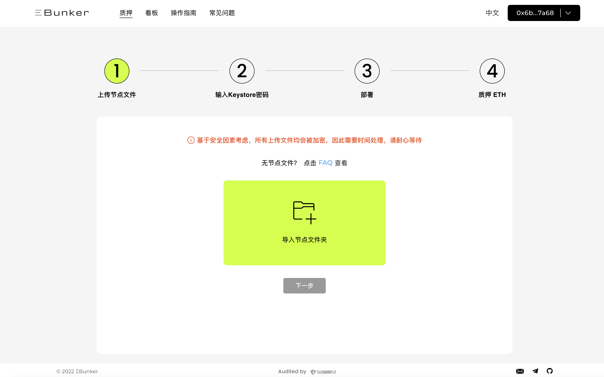

# Step 1: 上传节点文件

#### 上传节点Key至Ebunker

* 将ebunker文件夹上传至官网，Ebunker技术人员将进行节点部署。
* 点击链接上传 [https://www.ebunker.io/stake/upload](https://www.ebunker.io/stake/upload)。&#x20;

<figure><figcaption></figcaption></figure>
