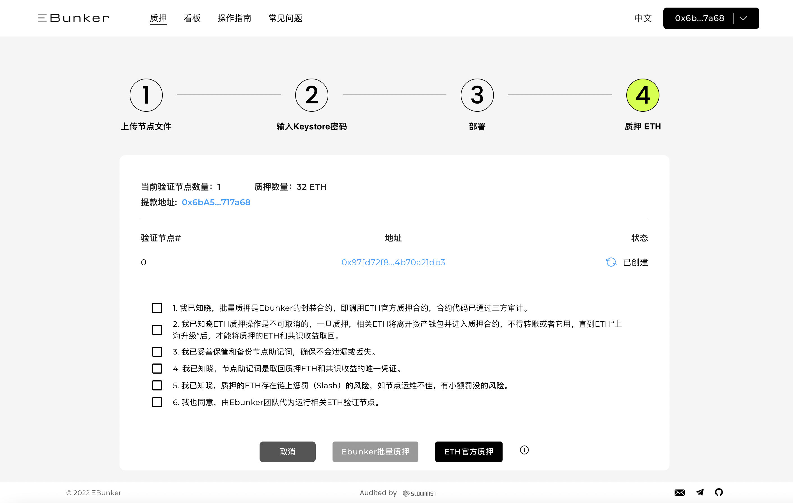
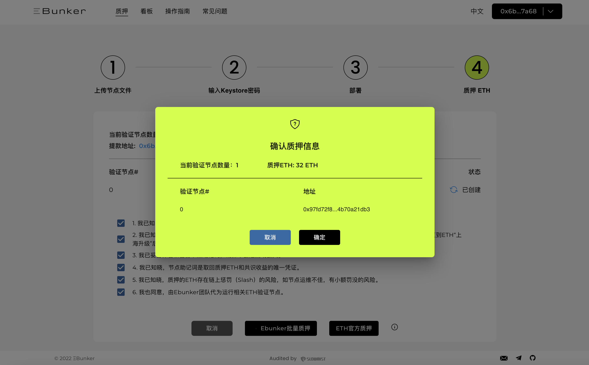

# Step 4: 质押交易

在节点部署完成后，质押窗口打开。对于上传节点文件的用户您有以下两种方式去质押ETH：

* 使用Ebunker进行批量质押，请点击[ https://www.ebunker.io/stake ](https://www.ebunker.io/stake)，进入Ebunker进行质押。
* 使用ETH官方launchpad进行质押ETH

## Ebunker进行批量质押

点击`EBUNKER 批量质押`，确认质押信息完成ETH质押。 &#x20;

<figure><figcaption></figcaption></figure>

<figure><figcaption></figcaption></figure>

## ETH官方launchpad质押

* Launchpad：以太坊官方节点质押工具。
* 官方网址：[Launchpad](https://launchpad.ethereum.org/zh)

### 操作

**阅读通告**

* 点击`ETH官方质押`&#x20;
*

    <figure><figcaption></figcaption></figure>
* 点击`成为验证者`，请您认真阅读通告，阅读完成后点击`继续` 或 `我接受`阅读到最后“确认”页面。&#x20;

#### 选择执行客户端&选择共识客户端

* 该步骤为节点搭建操作，由Ebunker技术部门完成节点搭建与运维。
* 节点将会与您发送的keystore进行绑定，创建您的验证者。注：该文件只拥有签署区块的能力，无法操作您质押的资金。
* 选择执行客户端，保持默认状态不操作，点击`继续`；
* 选择共识客户端，保持默认状态不操作，点击`继续`。&#x20;

#### 生成密钥对

* 在第一步中您已完成密钥的生成与保存，可直接勾选页面最下方的 `我保持密钥安全，并且已经写下了我的助记词`，点击`继续` &#x20;

#### 上传存款数据文件

* 此文件代表有关您的验证器的公共信息，用来执行您的存款。在您存储密钥文件的ebunker文件夹下选择“deposit\_data-xxxxxx.json”文件拖至选框内，识别完成后点击`继续`&#x20;

#### 连接钱包

* 此步骤需要连接您发送ETH质押的钱包，钱包内要有足够的资金参与ETH的质押，点击您钱包的类型，弹出您的钱包账户进行连接。&#x20;
* **使用Metamask+Ledger硬件钱包质押说明（若未使用Ledger此步请忽略）**
  * 该方式需在浏览器安装Metamask、并下载[Ledger Live](https://www.ledger.com/ledger-live)，若您未安装或不会使用它们请[阅读](https://support.ledger.com/hc/zh-cn/articles/4404366864657-%E5%A6%82%E4%BD%95%E9%80%9A%E8%BF%87-MetaMask-%E8%AE%BF%E9%97%AE-Led)
  * 1.启用[盲签](https://support.ledger.com/hc/zh-cn/articles/4405481324433-%E5%9C%A8%E4%BB%A5%E5%A4%AA%E5%9D%8A-ETH-%E5%BA%94%E7%94%A8%E7%A8%8B%E5%BA%8F%E4%B8%AD%E5%90%AF%E7%94%A8%E7%9B%B2%E7%AD%BE%E5%90%8D?docs=true)并打开Debug模式，步骤如下：
    * 连接并解锁您的 Ledger 设备。
    * 打开以太坊应用程序。
    * 按右键导航到`Settings`设置。然后同时按两个按钮进行选择。
    * 在`Blind signing`盲签设置中，同时按下两个按钮将`NOT Enabled`切换为`Enabled`以启用盲签交易。
    * 按右键查看`Debug data`设置，同时同时按下两个按钮将`NOT Displayed`切换为`Displayed`以启用排除故障数据。
    * 更改完成按右键两次显示`Back`，同时按下两个按钮点击返回主页。 
  * 2.Ledger连接Metamask钱包
    * 点击Metamask钱包插件，点击右上角彩球设置
    * 点击`连接硬件钱包`，选择Ledger点击继续，
    * 选择您支付ETH的ledger钱包账户连接Metamask。 &#x20;
  * 3.打开Launchpad质押页面，点击连接Metamask钱包，选择ledger硬件钱包地址连接Launchpad进行签名。&#x20;

#### 了解风险&确认信息

* 此页面内显示的验证者数量是创建validator key时您选择创建的数量，在您上传的“deposit\_data-xxxxxx.json”识别确认。仔细阅读并勾选确认信息，确认完成后点击`继续`&#x20;

#### 支付ETH完成质押。

* 您将为您的验证者完成最终的ETH质押，每个验证者将支付32ETH。
* 查看页面内的验证者公钥，点击[ETH官方浏览器](https://beaconcha.in/)进行二次查询核对。该资金将成为您的验证者质押资金。确认完成后点击`发送存款`进行支付。
* 使用ledger钱包用户，需在ledger上完成签名确认。
* 该资金只能由您自己控制操作，选择取消质押时，资金将转回您在创建密钥时填写的ETH提现地址。&#x20;

#### 恭喜您！您的ETH已经质押完成，可以在Ebunker内查询您的验证者信息啦！点击[查看您的节点](https://www.ebunker.io/dashboard)

也可使用ETH官方浏览器或Ebunker浏览器查看节点状态
